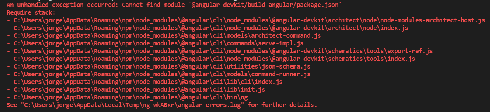

# Sanatorio Allende FrontEnd
------------------------------------------------------

### __Como ejecutar el proyecto?__

* Clonar o descargar el Repositorio
* Abrir el proyecto en Visual Code e insertar en la Terminal: ng serve -o
* Jugar

### __Tecnologias que utilizaron__

* Framework Bootstrap para el diseño responsive
* SweetAlert2 para mostrar los mensajes de que si el Jugador Gano o Perdio

### __Links de las Tecnologias usadas__

[Bootstrap 5.0](https://getbootstrap.com/)
[SweetAlert2](https://sweetalert2.github.io/)

### __En caso de error__

**Si al momento de ejecutar el proyecto le sale un error como figura en la imagen, poner en la terminal del proyecto: npm install, esperar que se instale y lanzar nuevamente ng serve -o**
